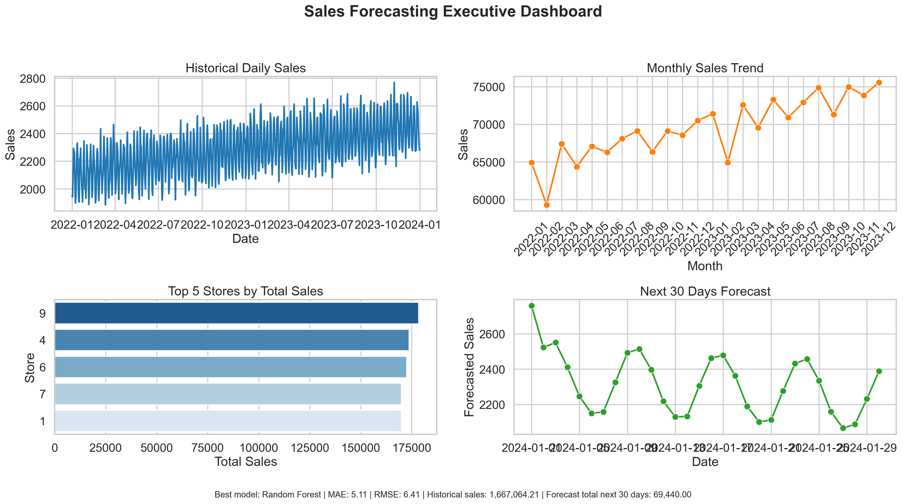
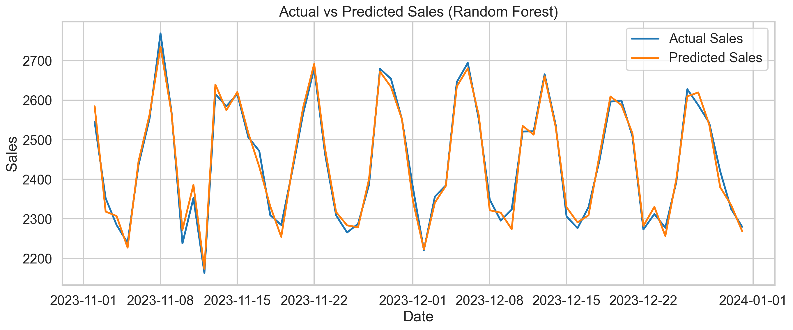
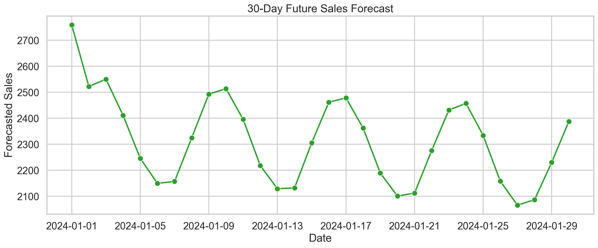

# FUTURE_ML_01

Production-style machine learning project for sales and demand forecasting using historical time-series data.

## Project Snapshot

- Problem: forecast future sales for business planning
- Dataset: Kaggle `abhishekjaiswal4896/store-sales-dataset`
- Models: Linear Regression, Random Forest Regressor
- Best model: Random Forest
- Test MAE: `5.1079`
- Test RMSE: `6.4132`
- Forecast horizon: `30 days`

## What I focused on
- Building an end-to-end ML project
- Learning time-series forecasting
- Applying ML to a business use case

## Final Outcome

The project forecasts the next 30 days of sales from historical store-level time-series data and packages the results in both:

- code-first ML artifacts
- visual dashboard-ready outputs for review in Git, VS Code, Power BI, or Tableau

## Key Results

- Random Forest outperformed Linear Regression on the time-based test set.
- Sales increased by `8.11%` from `2022` to `2023`.
- `December` was the peak sales month.
- `Store 9` was the top-performing store.
- Promo days delivered about `13.11%` higher average sales than non-promo days.
- The 30-day forecast total is available in the exported dashboard and forecast CSV files.

## Visual Deliverables

### Executive Dashboard

This is the main image a reviewer can inspect directly from the repository:



### Additional Forecast Visuals

Actual vs predicted:



Future 30-day forecast:



## Power BI / Tableau Ready Outputs

The repository includes clean export files so the same project can be presented in BI tools:

- `outputs/dashboard/dashboard_kpi_summary.csv`
- `outputs/dashboard/dashboard_actual_vs_predicted.csv`
- `outputs/dashboard/dashboard_forecast_summary.csv`
- `outputs/dashboard/dashboard_monthly_summary.csv`
- `outputs/dashboard/dashboard_store_summary.csv`
- `outputs/dashboard/dashboard_model_metrics.csv`

Recommended BI dashboard layout:

- KPI cards for best model, MAE, RMSE, top store, historical sales, forecast total
- line chart for historical sales
- line chart for actual vs predicted sales
- line chart for 30-day forecast
- bar chart for top stores
- monthly sales trend view

## Repository Structure

```text
FUTURE_ML_01/
|-- data/raw/store_sales.csv
|-- notebooks/sales_demand_forecasting.ipynb
|-- src/forecasting_pipeline.py
|-- run_project.py
|-- test_project.py
|-- build_notebook.py
|-- models/
|-- outputs/figures/
|-- outputs/metrics/
|-- outputs/dashboard/
```

## Tech Stack

- Python
- pandas
- numpy
- matplotlib
- seaborn
- scikit-learn
- joblib

## Dataset

- Source: Kaggle dataset `abhishekjaiswal4896/store-sales-dataset`
- Local file used in repo: `data/raw/store_sales.csv`
- Core columns: `Date`, `Store`, `Sales`, `Promo`, `Holiday`

## ML Workflow

1. Load the CSV dataset and sort it chronologically.
2. Clean duplicates, missing values, and outliers.
3. Perform EDA for trend and seasonality analysis.
4. Create calendar, lag, and rolling average features.
5. Split the data using a time-based train-test strategy.
6. Train Linear Regression and Random Forest models.
7. Evaluate using MAE and RMSE.
8. Forecast the next 30 days recursively.
9. Export figures, metrics, saved models, and dashboard-ready files.

## How To Run

Install dependencies:

```powershell
python -m pip install -r requirements.txt
```

Run the full project:

```powershell
python run_project.py
```

Run validation checks:

```powershell
python test_project.py
```

Regenerate the notebook:

```powershell
python build_notebook.py
```

## Files Reviewers Should Check First

- `README.md`
- `notebooks/sales_demand_forecasting.ipynb`
- `src/forecasting_pipeline.py`
- `outputs/dashboard/executive_dashboard.png`
- `outputs/metrics/model_comparison.csv`
- `outputs/metrics/future_30_day_forecast.csv`

## Business Value

This project helps a business:

- estimate near-term future sales
- prepare inventory ahead of demand spikes
- improve staffing decisions during peak months
- understand promotion effectiveness
- compare simple and advanced forecasting models

## Notes

- The notebook is included in Jupyter style for interview presentation.
- The Python pipeline is separated into reusable functions for cleaner engineering quality.
- The repository includes generated outputs so reviewers can inspect the result without running the code first.
