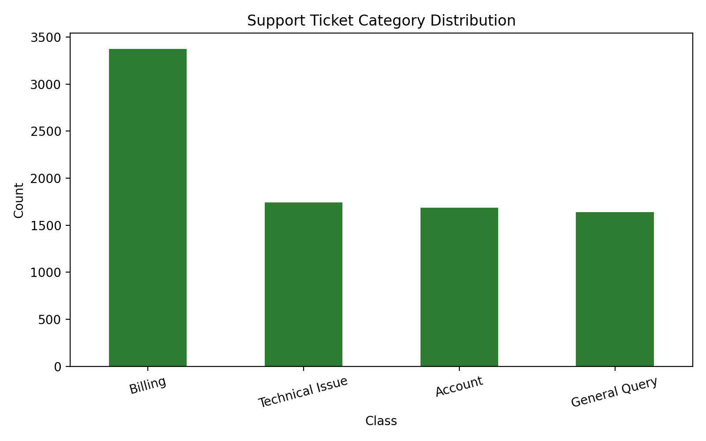
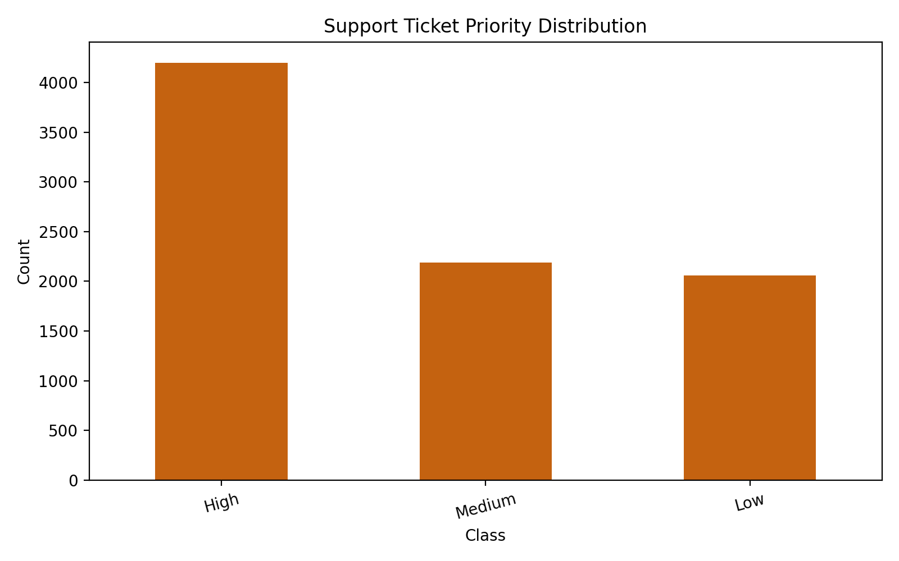
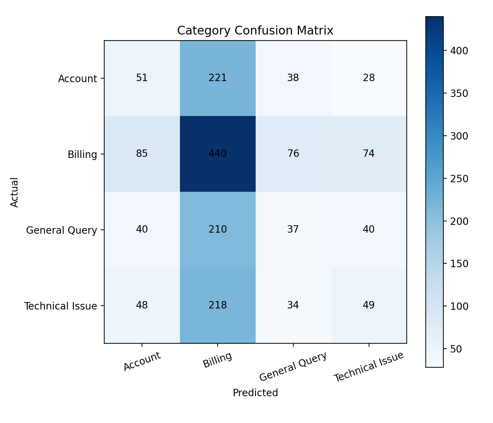
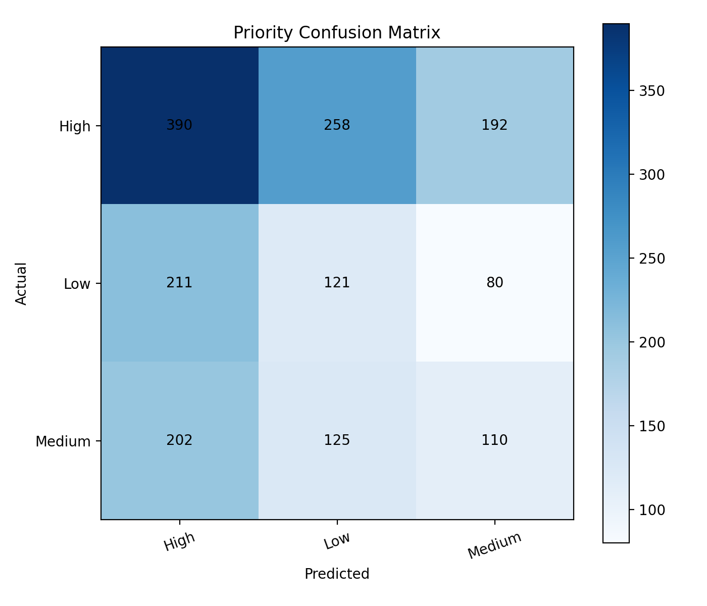

# FUTURE_ML_02

Support Ticket Classification & Prioritization project built in a simple, interview-friendly way using NLP and classical machine learning.

## Problem Statement

Support teams receive a lot of tickets every day, and reading each one manually takes time. This project helps by:

- classifying each support ticket into a business category
- predicting how urgent the ticket is

The system uses ticket subject and description text to predict:

- `Billing`
- `Technical Issue`
- `Account`
- `General Query`

and also:

- `High`
- `Medium`
- `Low`

## Business Use Case

This kind of system is useful for SaaS companies, e-commerce support teams, and customer care teams that want to:

- route tickets to the right team faster
- detect urgent issues earlier
- reduce manual triage work
- improve first response time

## Dataset

- Source: Kaggle `suraj520/customer-support-ticket-dataset`
- Local file used here: `data/customer_support_tickets.csv`
- Total records after cleaning: generated from the Kaggle customer support dataset

The original dataset has ticket types such as `Refund request`, `Billing inquiry`, `Technical issue`, `Cancellation request`, and `Product inquiry`.

To match the project objective, the labels were adapted like this:

- `Billing inquiry` and `Refund request` -> `Billing`
- `Technical issue` -> `Technical Issue`
- `Cancellation request` -> `Account`
- `Product inquiry` -> `General Query`

For priority:

- `Critical` was merged into `High`
- `High`, `Medium`, and `Low` stayed the same

If a priority value is missing, the code also includes a simple keyword-based fallback rule.

## Approach

1. Load the CSV data
2. Merge ticket subject and description into one text field
3. Clean the text using lowercase conversion, punctuation removal, tokenization, stopword removal, and optional lemmatization
4. Compare `TF-IDF` and `Bag of Words`
5. Train separate models for:
   - category classification
   - priority prediction
6. Evaluate with accuracy, precision, recall, F1-score, and confusion matrix
7. Save trained models, predictions, metrics, and visuals

## Models Used

- Logistic Regression
- Multinomial Naive Bayes
- Random Forest

## Project Structure

```text
FUTURE_ML_02/
|-- README.md
|-- notebooks/
|   |-- support_ticket_classification.ipynb
|-- src/
|   |-- data_preprocessing.py
|   |-- feature_engineering.py
|   |-- model_training.py
|   |-- evaluation.py
|   |-- predict.py
|-- data/
|-- models/
|-- outputs/
|   |-- metrics/
|   |-- predictions/
|   |-- visuals/
```

## Results Summary

After running the training pipeline, check these files first:

- `outputs/metrics/best_model_summary.csv`
- `outputs/metrics/model_comparison.csv`
- `outputs/metrics/category_classification_report.csv`
- `outputs/metrics/priority_classification_report.csv`
- `outputs/predictions/predictions.csv`
- `outputs/visuals/category_confusion_matrix.png`
- `outputs/visuals/priority_confusion_matrix.png`

Best result from the latest run:

- Category model: `Random Forest + Bag of Words`
- Category macro F1: about `0.2516`
- Priority model: `Naive Bayes + Bag of Words`
- Priority macro F1: about `0.3359`

The scores are not extremely high because this dataset is fairly synthetic and several ticket classes overlap a lot in wording. I kept the project honest and saved the real evaluation outputs instead of hiding that.

## Visual Outputs

### Category Class Distribution



### Priority Class Distribution



### Category Confusion Matrix



### Priority Confusion Matrix



## How To Run

Install required libraries if needed:

```powershell
python -m pip install pandas numpy scikit-learn nltk matplotlib joblib
```

Run the full training pipeline:

```powershell
cd FUTURE_ML_02
python -m src.model_training
```

Predict a new ticket:

```powershell
python -m src.predict --subject "Payment failed" --text "My payment failed twice and I need help immediately."
```

## How This Helps Businesses

This project can help businesses:

- reduce ticket handling time
- send tickets to the correct queue automatically
- flag urgent complaints faster
- improve customer experience
- support agents with a simple triage system

## Notes

- This project is beginner-friendly on purpose.
- The code is modular so each step is easy to understand.
- The notebook version is included for interview and internship presentation.
